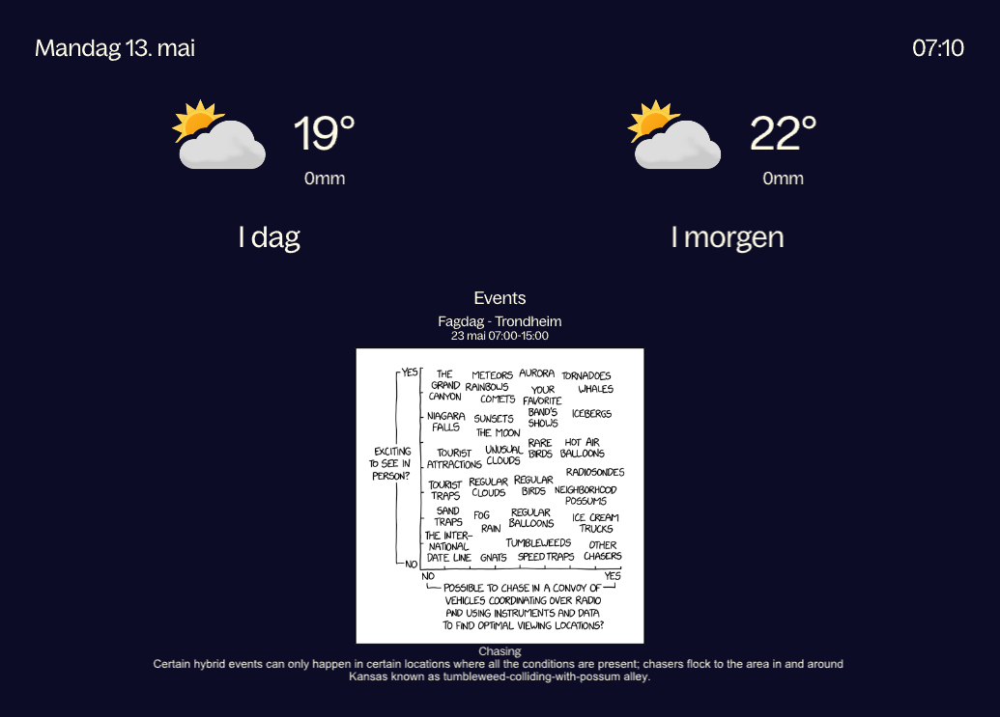

# Infoskjerm for Trondheimkontoret

Infoskjerm for Trondheimkontoret, skrive i Rust, med Slint.

## Implementert funksjonalitet
* XKCD
* Vær
* Klokke og dato

## Idear til funksjonalitet
* Busstider
* Møteromsstatus
* Tracking av wolt/foodora
* Aktivitetskalender
* Andre kule ting?
